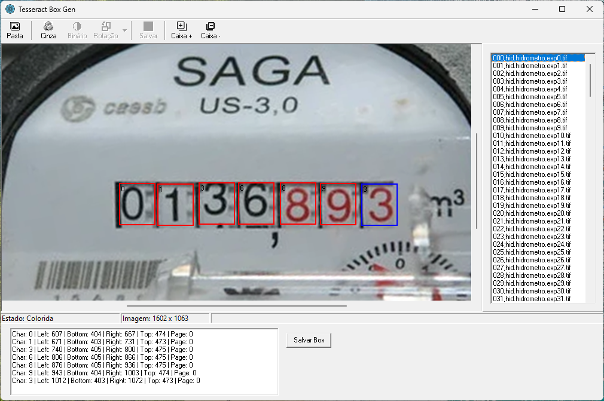

# Gerador de arquivos .box a partir de imagens .tif e arquivos gt.txt, permitindo definir as coordenadas das caixas e ajustes finos

O objetivo principal do programa é **gerar arquivos `.box` a partir de imagens `.tif` e arquivos `gt.txt`**, permitindo ao usuário definir e ajustar finamente as coordenadas das caixas (bounding boxes) sobre as imagens. Essas caixas são usadas para marcar regiões específicas nas imagens TIFF, geralmente para tarefas como reconhecimento óptico de caracteres (OCR) ou anotação de dados.

### Funcionalidades principais:

- **Leitura de imagens TIFF**: o programa carrega imagens `.tif`, incluindo aquelas com orientações variadas, garantindo a exibição correta para facilitar a marcação.
- **Importação de arquivos `gt.txt`**: arquivos de ground truth que contêm informações iniciais das caixas ou anotações são lidos para auxiliar na definição das regiões.
- **Definição e ajuste das caixas (`.box`)**: o usuário pode criar, editar e ajustar as coordenadas das caixas que delimitam áreas de interesse na imagem.
- **Exportação dos arquivos `.box`**: após as definições e ajustes, o programa gera os arquivos `.box` correspondentes, que podem ser usados em processos posteriores, como treinamento de modelos OCR.

### Contexto de uso:

Esse tipo de ferramenta é fundamental em projetos de processamento de imagens e reconhecimento de texto, onde a precisão na delimitação das áreas de interesse impacta diretamente na qualidade dos resultados.

## Tecnologias Utilizadas

Este projeto foi desenvolvido em **Delphi 7** e utiliza o pacote de componentes **ImageEn** para manipulação avançada de imagens, especialmente para o carregamento e exibição de arquivos TIFF.  

O ImageEn oferece suporte a múltiplas páginas, compressão, e correção automática da orientação das imagens TIFF, funcionalidades essenciais para o correto processamento das imagens neste projeto.
